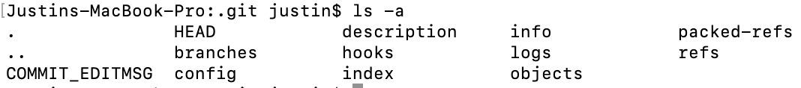
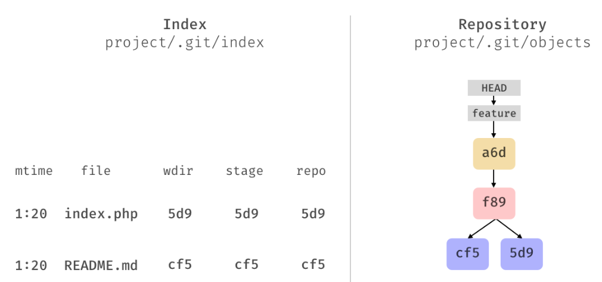
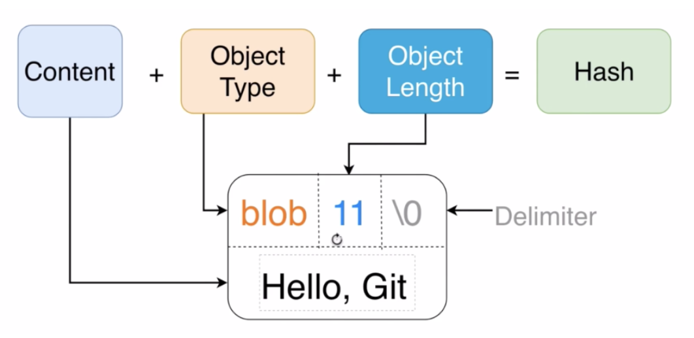

# midterm
### Justin Yee, A00983545

#### First section:
You must explain the difference between cloning vs fetching vs pulling. Give real world    examples of how they differ.

>'git pull' does a 'git fetch' followed by a 'git merge'. This updates your local branch up to date with the remote version automatically (and you cannot review the merge changes). It also updates your other remote-tracking branches.
>
>'git pull' is useful because the merging is done automatically. If you and your team closely manage your branches, you may be okay with simply using git pull and save the effort of manually reviewing the merge.

>'git fetch' updates the remote-tracking branches found under refs/remotes/<remote>/ and does not change own local branches under refs/heads.
>
>'git fetch' is useful if you need to keep you want to update your remote-tracking branches, but don't want to merge right away due to anticipated bugs/errors/merge conflicts. It is also preferred if you do not want git to do the merge for your automatically, and you wanted to do it manually.

>'git clone' is used to make a copy of an existing repo in a new directory. It also automatically creates remote tracking branches for each branch in the cloned repository[1][1].
>
>You would need to have cloned a repo and have the remotes setup before you could git pull or git fetch from the cloned repo.

#### Second section:
Create a markdown table that shows the basic differences between Trello and Asana. The list does not need to be exhaustive. Make sure to use a table.

| Trello        | Asana         |
| ------------- |:-------------| 
| Digital sticky board      | Project based / task oriented | 
| Mimics real life boards      | Has calendar and timeline formats      |   
| Easier to work with, but less features | Has conversations that can be filtered and sorted      |
| | Has email system with automatic updates|
| | Has the ability to add attachments to tasks |

#### Third Section: Answer the following 3 questions:

Question 1: What is the .git folder? Where is the object database in this folder?

>
>
>The git folder contains all the information related to git and the repository. Information about the filenames, the local repo version, remote repo version, working directory version are stored in the index file for instance. It also contains the git history.
>
>Git stores objects in the 'objects' folder. This is the database (content addressable file system) that git uses.

Question 2: Explain in detail how the git hash-object function works. 

>'git hash-object' takes the file/content you handed it and returns a hash key that is used to store it in the git database. Adding a -w option tells git to also write the object to the database (create a new object). The output is a 40-character checksum SHA-1 hash. The subdirectory is named the first 2 letters of the SHA-1 and the filename is the remaining 38 characters[2].

>For example:
>echo "Hello World" | git hash-object --stdin -w
>this will pass "Hello World" to the git hash-object command and write it to the database. the --stdin tells git that it is to expect the hello world string from the terminal

Question 3: Where does git internally store the file names to our files? How are tree objects related to this?

>Filenames of the files are stored in the index file. The index file keeps track of five things: file names, update time, and repo versions for local, remote, and working directory, as can be seen here:

>Notably, the git objects themselves do not store metadata like file names as can be seen in the following image:

>When changes are added to the staging area (after a commit), git updates those changes to the index file and then creates new commit, blob, or tree objects and saves them to the objects directory.
>
>A tree object contains references to other blobs or subtrees.

[1]: https://git-scm.com/docs/git-clone
[2]: https://git-scm.com/book/en/v2/Git-Internals-Git-Objects